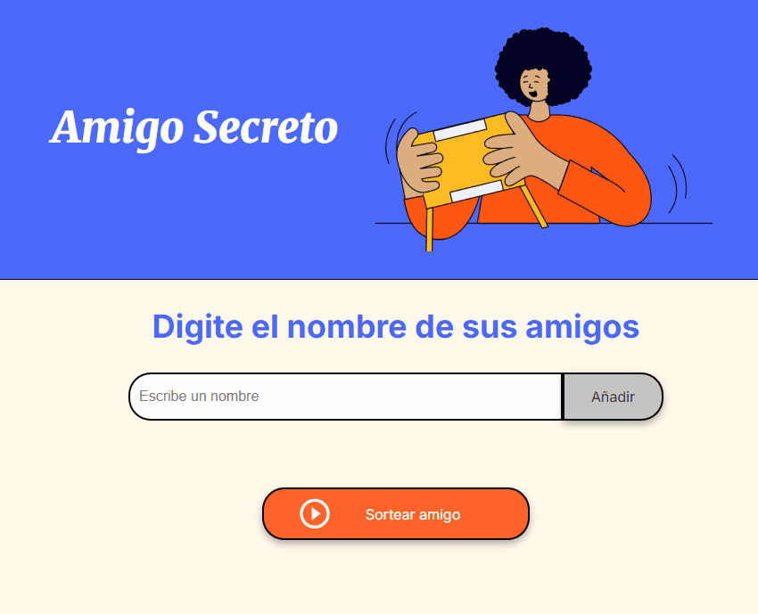

# 🎲 Proyecto Amigo Secreto


<p align="center">
  
</p>

> Una aplicación web sencilla y divertida para organizar sorteos del "Amigo Secreto". Añade participantes, evita duplicados y sortea un nombre al azar con un solo clic.
> ¡Mención a Alura Latinoamérica por dar las bases de HTML, CSS y JavaScript aplicadas en este proyecto tan intuitivo!

---

### 📜 Tabla de Contenidos
1. [Descripción del Proyecto](#-descripción-del-proyecto)
2. [Demostración](#-demostración)
3. [Características Principales](#-características-principales)
4. [Tecnologías Utilizadas](#-tecnologías-utilizadas)
5. [Acceso al Proyecto](#-acceso-al-proyecto)

---

### 📝 Descripción del Proyecto:
"Amigo Secreto" es una herramienta interactiva diseñada para simplificar la organización del tradicional juego del amigo invisible. Permite a los usuarios crear una lista de participantes de forma segura, validando que no se ingresen nombres duplicados o vacíos. Con una interfaz limpia e intuitiva, el sorteo se realiza de manera justa y transparente, mostrando el resultado al instante.

### 🎥 Demostración:
Aquí puedes ver una demostración rápida de cómo funciona la aplicación:



---

### ✨ Características Principales:
- **Interfaz Intuitiva**: Diseño limpio y fácil de usar.

- **Gestión de Participantes**: Añade nombres a la lista del sorteo de forma dinámica.

- **Validación de Datos**:
    - Impide agregar campos vacíos.
    - Evita nombres duplicados (no distingue mayúsculas de minúsculas).
    - Formatea los nombres para una visualización consistente (primera letra en mayúscula).

- **Sorteo Justo**: Elige un participante de forma completamente aleatoria.

- **Feedback Visual**: Muestra mensajes de error claros si el usuario comete un error.

### 🛠️ Tecnologías Utilizadas:
- **HTML5**: Estructura semántica del contenido.

- **CSS3**: Estilos, diseño responsivo y variables para un tema consistente.

- **JavaScript (ES6)**: Lógica del cliente, manipulación del DOM y funcionalidad interactiva.

---

### 🚀 Acceso al Proyecto:

**Prerrequisitos:**
- Un navegador web moderno (Chrome, Firefox, Safari, etc.).

**Para usarlo localmente:**
1. Clona este repositorio en tu máquina local:
   ```bash
   git clone [[https://github.com/bonifaci0/alura-challenge-amigo-secreto.git](https://github.com/bonifaci0/alura-challenge-amigo-secreto.git)]
